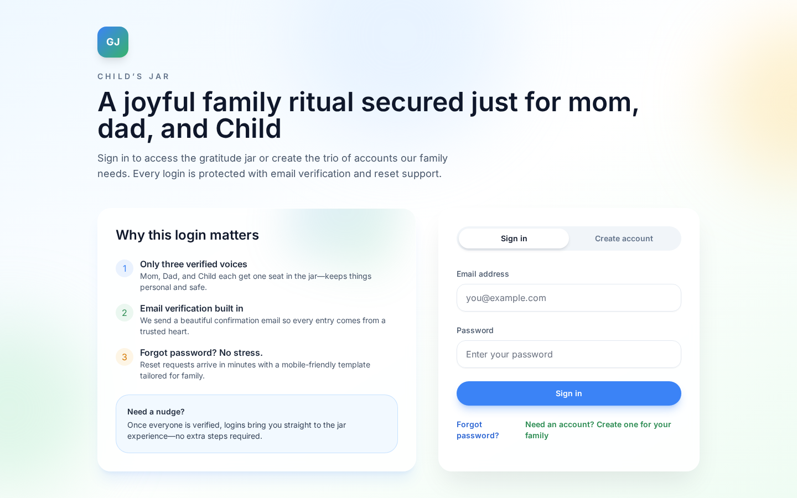
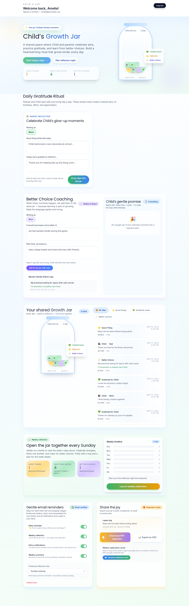

# Growth Jar

Growth Jar is a family-focused gratitude and personal development tracker built on a PERN stack. The platform helps family members capture daily reflections, celebrate collective wins, and visualize long-term growth through a secure, role-aware experience.

# Screenshots




## Table of Contents
- [Growth Jar](#growth-jar)
- [Screenshots](#screenshots)
  - [Table of Contents](#table-of-contents)
  - [Overview](#overview)
  - [Demo Site](#demo-site)
  - [Features](#features)
  - [Tech Stack](#tech-stack)
  - [Project Structure](#project-structure)
  - [Prerequisites](#prerequisites)
  - [Setup](#setup)
    - [Environment Variables](#environment-variables)
    - [Backend](#backend)
    - [Frontend](#frontend)
    - [Docker](#docker)
  - [Running with Docker Compose (Step-by-Step)](#running-with-docker-compose-step-by-step)
  - [Screenshots](#screenshots-1)
  - [Testing](#testing)
  - [Documentation](#documentation)
  - [Contributing](#contributing)
  - [License](#license)

## Overview
Growth Jar separates the frontend and backend into dedicated workspaces. The React client delivers the Growth Jar experience while the Express API powers authentication, journaling workflows, and persistence. Authentication is role-based and supports predefined family members (mom, dad, and child) who must verify their email before gaining access.

## Demo Site
- Access the hosted demo at [https://growthjar.dodon.in/](https://growthjar.dodon.in/).
- Demo accounts: `mom@example.com`, `dad@example.com`, and `child@example.com`.
- The password for all demo users is `growthjar`.
- Uptime is not guaranteed, and the demo environment may be offline without notice.
- Demo data is cleared on a regular basis, so any entries you create may be removed.

## Features
- Role-based authentication with email verification for each family member.
- Daily gratitude entry creation, browsing, and reflection insights.
- Prisma-powered data persistence in Postgres with audited migrations.
- Centralized logging via Winston and Morgan for observability.
- Comprehensive API documentation exposed through Swagger UI.
- Docker Compose configuration for a one-command local development stack.

## Tech Stack
| Layer      | Technologies |
| ---------- | ------------ |
| Frontend   | React (Vite), Tailwind CSS |
| Backend    | Node.js, Express.js, Prisma ORM, Winston, Morgan |
| Database   | Postgres |
| Tooling    | Jest, React Testing Library, Docker, Docker Compose, Swagger (OpenAPI) |

## Project Structure
```
/
├── client/              # React application (Vite)
│   ├── public/
│   └── src/features     # Feature-aligned UI modules
├── server/              # Express + Prisma API
│   ├── prisma           # Prisma schema and migrations
│   └── src/modules      # Feature modules (controllers, services, validators)
├── docker-compose.yml   # Local development stack definition
├── API-SEPCS.md         # API reference and contracts
├── DB-SCHEMA.md         # Database schema documentation
└── CHANGELOG.md         # Release history
```

## Prerequisites
- Node.js 18+
- npm 9+
- Docker & Docker Compose (optional, for containerized workflows)
- Access to a Postgres instance (connection string supplied via environment variables)

## Setup
Clone the repository and install dependencies in both workspaces.

```bash
git clone <repo-url>
cd RishisJar
```

### Environment Variables
1. Copy the root example environment file and update secrets:
   ```bash
   cp .env.example .env
   cp client/.env.example client/.env   # if present
   ```
2. Set authentication values such as `AUTH_MOM_EMAIL`, `AUTH_DAD_EMAIL`, `AUTH_CHILD_EMAIL`, and `CHILD_NAME` to match the intended family members.
3. Provide a Postgres connection string and any other service credentials referenced in the `.env` files. Docker Compose and the local workspaces both read from the root `.env` file.
4. The Express backend automatically loads these variables via [`dotenv`](https://www.npmjs.com/package/dotenv) in `server/src/config/env.js`, so restarting the server after editing `.env` is enough to apply new values.

### Backend
```bash
cd server
npm install
npm run prisma:migrate
npm run dev
```
- API available at `http://localhost:7500`.
- Health check at `http://localhost:7500/health`.
- Swagger UI at `http://localhost:7500/docs`.

### Frontend
```bash
cd client
npm install
npm run dev
```
- Vite dev server defaults to `http://localhost:5173`.
- Ensure `VITE_API_URL` (or equivalent) points to the running backend.

### Docker
```bash
docker compose up --build
```
- Uses values from `.env.example` with overrides from your local `.env` file.
- Backend and frontend containers are exposed on ports `7500` and `5173` respectively.
- Prisma migrations run automatically via `prisma migrate deploy` during container startup.

## Running with Docker Compose (Step-by-Step)
If you prefer to avoid installing Node.js and npm, you can run the whole project inside Docker containers. The steps below are wri
tten for someone who is brand new to technology. Follow them in order and do not worry if they seem long—each step is simple whe
n taken one at a time.

1. **Prepare a PostgreSQL database.**
   - You must have a PostgreSQL server that you can connect to from your computer (for example, a managed database from a cloud p
rovider or a PostgreSQL instance you installed yourself).
   - Create a database **and** a PostgreSQL user account that has permission to read, write, and create tables inside that databa
se.
   - Write down the following details because you will need them soon: the host name (where the database lives), the port number
 (usually `5432`), the database name, the user name, and the password.
2. **Download the project to your computer.**
   - Install [Git](https://git-scm.com/downloads) if you do not have it.
   - Open a terminal (also called “Command Prompt” or “PowerShell” on Windows, or “Terminal” on macOS/Linux).
   - Run the commands below to copy the project:
     ```bash
     git clone <repo-url>
     cd RishisJar
     ```
3. **Install Docker Desktop.**
   - Download Docker Desktop for your operating system from [https://www.docker.com/products/docker-desktop](https://www.docker
.com/products/docker-desktop).
   - Open Docker Desktop after installation and wait until it shows that Docker is running.
4. **Create the environment file.**
   - Still inside the `RishisJar` folder, copy the sample environment file into a real one:
     ```bash
     cp .env.example .env
     ```
   - Open the new `.env` file in a text editor.
   - Find the line that starts with `DATABASE_URL=` and replace the placeholder value with the connection string for the Postgres
 database you prepared in step 1. The string will look like this:
     ```
     postgresql://<username>:<password>@<host>:<port>/<database-name>?schema=public
     ```
   - Save the file.
5. **Start the app with Docker Compose.**
   - In the same terminal window, run:
     ```bash
     docker compose up --build
     ```
   - The first run may take a few minutes while Docker downloads everything it needs. When the logs stop scrolling and you see m
essages that the server is listening on port `7500` and the client is ready on port `5173`, the app is running.
6. **Open the app in your browser.**
   - Visit [http://localhost:5173](http://localhost:5173) in a web browser to use the frontend.
   - The backend API is available at [http://localhost:7500](http://localhost:7500).
7. **Stop the app when you are done.**
   - Return to the terminal window that is running Docker.
   - Press `Ctrl + C` once.
   - Run `docker compose down` to cleanly stop and remove the containers.

> **Important:** If the database user does not have permission to create tables, the backend will fail to start because Prisma c
annot run migrations. Ensure the PostgreSQL user from step 1 can create, update, and delete tables in the database you created.

## Screenshots
Add screenshots that demonstrate new or updated user interfaces to help reviewers understand visual changes.

1. Run the app locally (for example with `docker compose up --build`).
2. Capture the screen area that shows the change (use tools like the built-in screenshot feature on your operating system).
3. Save the image inside the repository (for example in a `docs/screenshots/` folder).
4. Reference the image in pull requests or documentation using standard Markdown syntax:
   ```markdown
   
   ```

## Testing
Run unit and integration tests with npm scripts in each workspace.

```bash
cd server
npm test
```

For the client:
```bash
cd client
npm test
```

Additional tooling such as `npm run lint` and `npm run test:watch` can be executed if configured.

## Documentation
- API reference and contracts: [`API-SEPCS.md`](./API-SEPCS.md)
- Database schema details: [`DB-SCHEMA.md`](./DB-SCHEMA.md)
- Release notes and change log: [`CHANGELOG.md`](./CHANGELOG.md)
- Swagger UI served from the backend at `/docs`.

## Contributing
- Use feature-based branches (`feature/<name>`, `fix/<name>`, `chore/<name>`).
- Keep frontend and backend logic in their respective feature/module directories.
- Update related documentation (`/docs`, API specs, DB schema, etc.) when introducing changes.
- Run tests and linters before opening a pull request.
- Submit pull requests with a summary, rationale, and screenshots for UI updates. One approval is required before merging.

## License
This project is currently unlicensed. All rights reserved.
